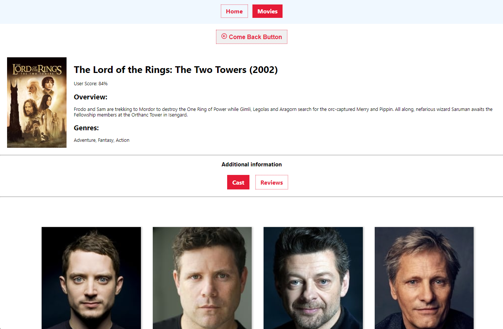

**Read in other languages: [english](README.md), [polish](README.pl.md).**

## Movie search app.

The app uses the themoviedb.org API to fetch popular movies, search for movies based on keywords, and get detailed information about specific movies.

- **Home**: Displays a list of popular videos.

- **Movies**: Allows users to search for movies using keywords.

- **Movie Details**: Provides detailed information about a specific movie, including cast and reviews.

## Preview




## API themoviedb.org 
For the backend, use themoviedb.org API. You need to register (you can enter any data) and get API key. Enter the api key in the env.example file. Used endpoints:

```javascript
API_ENDPOINTS = {
  TRENDING_MOVIES: '/trending/movie/day', //a list of the most popular movies for today to create a collection on the home page page.
  MOVIE_DETAILS: '/movie/', //Request full movie info for the movie page.
  SEARCH_MOVIE: '/search/movie', // keyword search for a movie on the movies page.
};
```

## Routes.
A basic routing for a movie search and storage application.
The app have the following routes:

```javascript 
The ``Home'' //component, the home page with a list of popular movies.
The /'/movies' - //component Movies, a page of movie search by keyword. keyword.
The /'movies/:movieId' //component MovieDetails, a page with detailed information about the movie.
The /'movies/:movieId/cast' //component Cast, information about the cast. Rendered on the page MovieDetails.
The /'movies/:movieId/reviews' //component Reviews, information about reviews. Rendered on the page MovieDetails.
```

If a user has accessed a non-existent route is be redirected to the home page.

## Installation

To run the Movie Search application locally, follow these steps:

1. Clone the repository:

```bash
   git clone [repository-url]
```

2. Change to the project directory:

```bash
   cd [repository-name]
```

3. Install and start dependencies:
```bash
   npm install
   npm run dev
   npm start
```

The application should now be accessible in your web browser at
http://localhost:3000.

## How it works

The main component is **App**, defined in **App.jsx**.