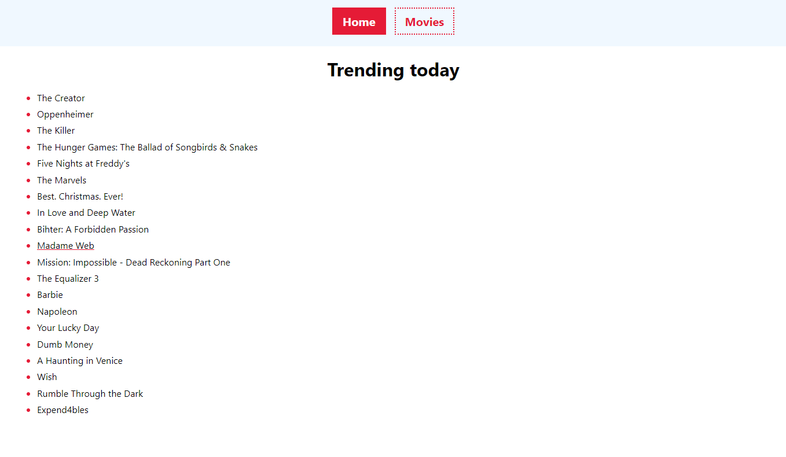
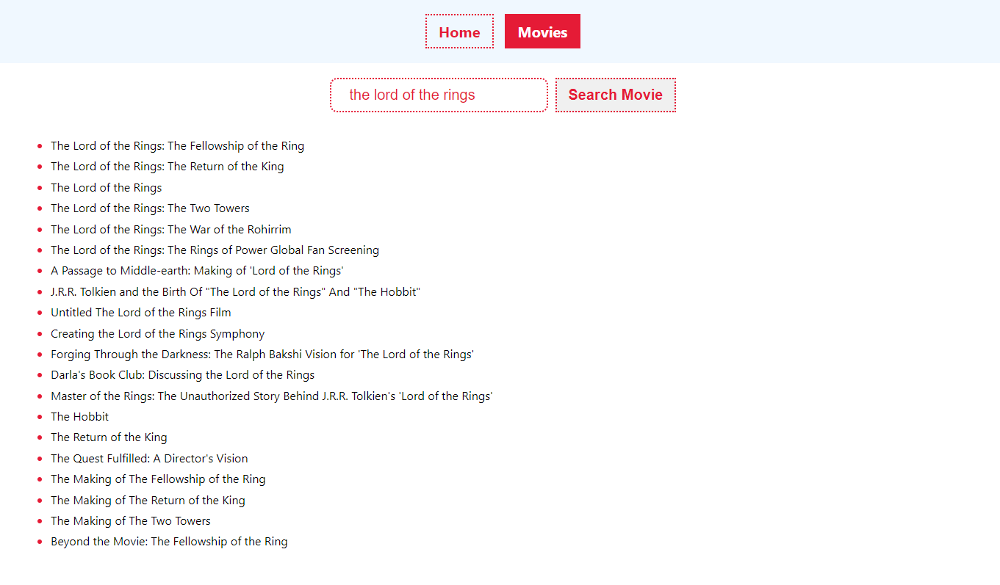
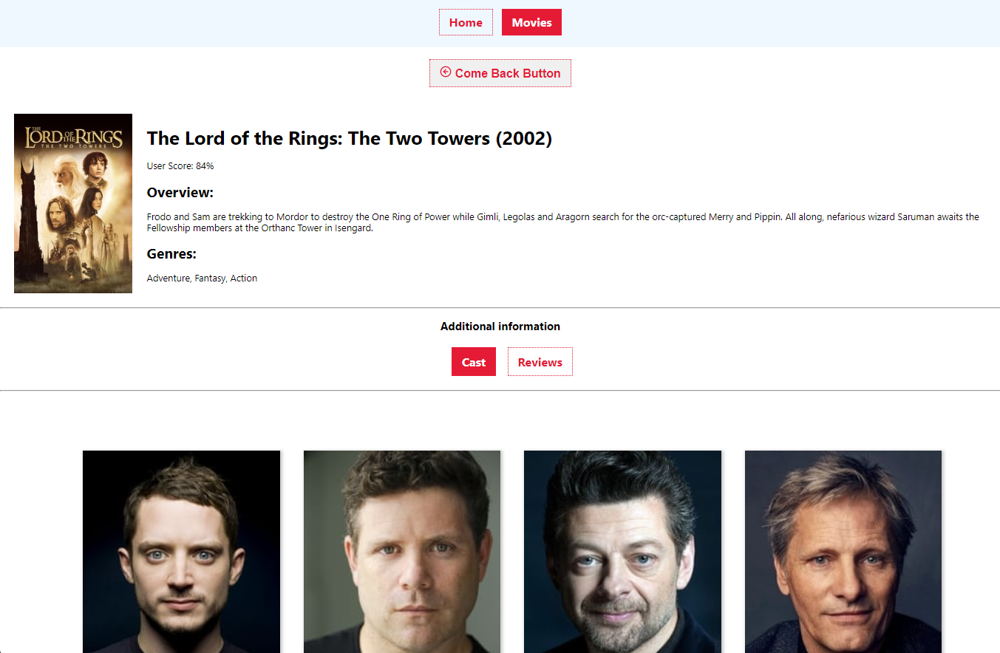

**Przeczytaj w innych językach: [angielski](README.md), [polski](README.pl.md).**

## Aplikacja do wyszukiwania filmów.

Aplikacja korzysta z interfejsu API themoviedb.org w celu pobierania popularnych filmów, wyszukiwania filmów na podstawie słów kluczowych i uzyskiwania szczegółowych informacji o konkretnych filmach.

- **Strona główna**: Wyświetla listę popularnych filmów.

- **Filmy**: Umożliwia użytkownikom wyszukiwanie filmów za pomocą słów kluczowych.

- **Szczegóły filmu**: Zawiera szczegółowe informacje o konkretnym filmie, w tym o obsadzie i recenzjach.

## Podgląd




## API themoviedb.org
Jako backend użyj interfejsu API themoviedb.org. Należy się zarejestrować (można wprowadzić dowolne dane) i uzyskać klucz API. Klucz api wprowadź w pliku env.example. Używane punkty końcowe:


```javascript
API_ENDPOINTS = {
   TRENDING_MOVIES: '/trending/movie/day', // lista najpopularniejszych filmów na dany dzień, aby utworzyć kolekcję na stronie głównej.
   MOVIE_DETAILS: '/movie/', // poproś o informacje o filmie.
   SEARCH_MOVIE: '/search/movie', // wyszukiwanie według słowa kluczowego
};
```

## Trasy.
Podstawowy routing dla aplikacji do wyszukiwania i przechowywania filmów.
Aplikacja ma następujące trasy:

```javascript
Komponent ``Strona główna'' //, strona główna z listą popularnych filmów.
/'/movies' - //component Movies, strona wyszukiwania filmów według słów kluczowych. słowo kluczowe.
/'/movies/:movieId' //komponent MovieDetails, strona zawierająca szczegółowe informacje o filmie.
/'/movies/:movieId/cast' //komponent Obsada, informacja o obsadzie. Renderowane na stronie Szczegóły filmu.
/'/movies/:movieId/reviews' //komponent Recenzje, informacje o recenzjach. Renderowane na stronie Szczegóły filmu.
```

Jeśli użytkownik wszedł na nieistniejącą trasę, zostanie przekierowany na stronę główną.

## Instalacja

Aby uruchomić aplikację Movie Search lokalnie, wykonaj następujące kroki:

1. Sklonuj repozytorium:

```bash
   git clone [adres repozytorium]
```

2. Przejdź do katalogu projektu:

```bash
   cd [repository-name]
```

3. Zainstaluj i uruchom zależności:
 ```bash
   npm install
   npm run dev
   npm start
```

Aplikacja powinna być teraz dostępna w Twojej przeglądarce internetowej pod adresem
http://localhost:3000.

## Jak to działa

Głównym komponentem jest **App** zdefiniowana w **App.jsx**.